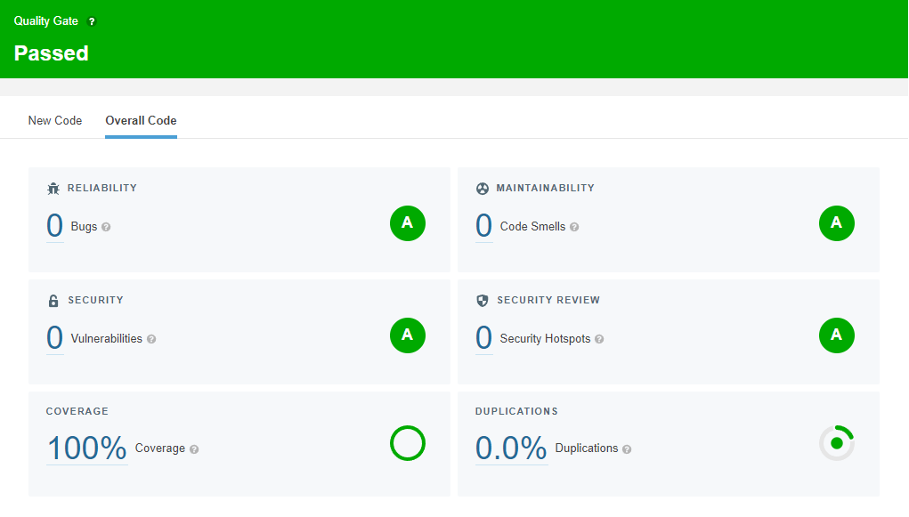

# backend-desafio-pitang

Diante do cenário atual, existe uma demanda gigante de pessoas para tomar a vacina para
o COVID-19. E com isso nossa cidade está precisando de um simples sistema para realizar
os agendamentos.
O processo consiste na criação de um portal onde será possível agendar pacientes para
tomar a vacina, construir uma página para consulta dos agendamentos feitos por dia e
horário.

## Conteúdo
<!--ts-->
* [Regras de Negócio](#regras-de-negócio)
* [Regras de Execução](#regras-de-execução)
* [Instalação](#instalação)
* [Uso](#uso)
* [Deploy](#deploy)
* [Sonarcloud Quality Gate Score](#sonarcloud-quality-gate-score)

<!--te-->

## Regras de Negócio

* O paciente deve informar seu nome, data de nascimento e dia e horário para o
agendamento.

* Deverá ser checado se o formulário foi preenchido.

* Os dados do paciente/agendamentos devem ser armazenados em memória.

* Dentro da página para consultar os agendamentos deve ser possível visualizar a
listagem de agendamentos feitos e informar se o agendamento foi realizado ou não,
e qual a conclusão do atendimento(se foi realizado).

* Quando o usuário der F5 ou recarregar a página os dados não podem ser perdidos.

## Regras de Execução

* Portal escrito em React, utilizar o react-datepicker para o gerenciamento das datas.
* Construir uma API em Node para receber os dados do portal.
* Axios como cliente http.
* Utilizar o Formik para a validação dos dados na view.
* IDE fica a sua escolha.

## Instalação

```bash
# clonar o repositório
https://github.com/klauss-m/backend-desafio-pitang.git

#instalar dependências
yarn install ou npm install

#o projeto contem um .env de exemplo, que deve ser utilizado com uma url postgres.
```

## Uso

```bash
#Inicializar o dev server
yarn dev ou npm dev

#realização de testes
yarn test ou npm test
```

## Deploy

Deploy efetuado no Heroku.

<https://backend-desafio-pitang.herokuapp.com/appointments>

## Sonarcloud Quality Gate Score


